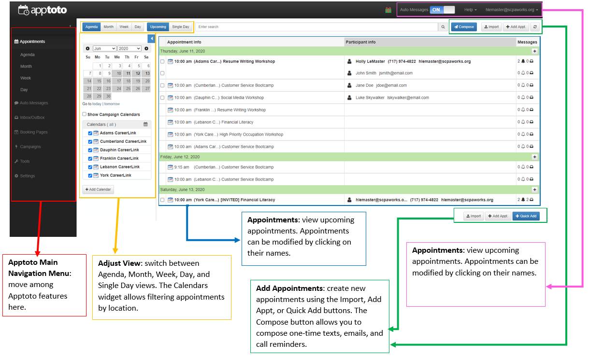
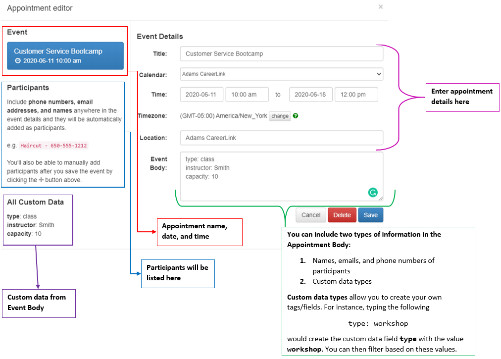

# Apptoto Appointments
<a href="./apptoto.html">Back</a>

## Table of Contents
1. <a href="#user-interface">User Interface</a>
1. <a href="#how-to-create-an-appointment">Create Appointment</a>
1. <a href="#how-to-edit-an-appointment">Edit Appointment</a>
1. <a href="#showhide-calendars">Show/Hide Calendars</a>
1. <a href="#change-the-date">Change the Date</a>

<!-- USER INTERFACE -->
## User Interface

Below is the interface for managing appointments in Apptoto.

<!-- MAKE AN APPOINTMENT -->
## How to Create an Appointment

1. Click the Add Appt. button.
1. In the Appointment Editor, enter the information for your appointment.

1. Click Save to save the appointment details. You will be prompted to enter participants.
1. Enter any participants you want to add to the event.
1. If you'd like to add the event to a Sign Up Page:
     1. In the Appointment Editor's right-hand sidebar, click **Add to Existing Signup Page**.
     1. Select the Sign Up Page that corresponds to your event's location.
1. Review the event information, and hit close to finish editing.

<!-- EDIT AN APPOINTMENT -->
## How to Edit an Appointment

1. Click on the name of the appointment.
1. Edit the contents of the appointment in the Appointment Editor.

<!-- SHOW/HIDE CALENDARS -->
## Show/Hide Calendars

1. Click the name of the calendar corresponding to the location you'd like to select.
1. All other calendars will be hidden from your view.
1. To disable filtering, click the **all** link next to the Calendars label.

<!-- CHANGE THE DATE -->
## Change the Date

1. Using the calendar navigation controls on the left side of the Appointments page, select the date you'd like to view.
1. You can quickly view the current or next day's date by clicking the **Go to today &#124; tomorrow** button below the calendar controls.

